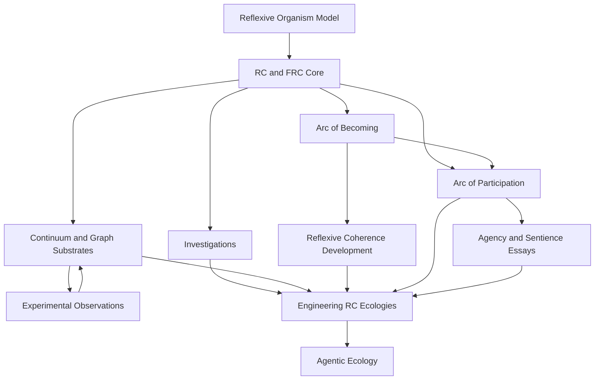

# Geometric Reflexive Coherence

Many approaches to complex systems begin with components, interactions, and a
space in which they evolve.

**Geometric Reflexive Coherence** begins one step earlier:

> **How can a system form the geometry, identities, functions, and possibilities
> through which its own evolution occurs?**

The theory starts from a non-negative coherence field and its flux. The field
induces geometry; that geometry shapes later flux; flux changes the field
again:

```text
C -> K[C] -> g[K] -> J[C,g] -> continuity -> C
```

The field writes the geometry. The geometry shapes the flux. The flux updates
the field. The loop is compact; its consequences are not.

- Space becomes support-derived rather than a passive container.
- Identity becomes an attractor formed by the field rather than an assigned
  label.
- Memory becomes retained geometry that changes later continuation.
- Function belongs to a formation in context rather than to isolated structure.
- Choice becomes a locally irreducible collapse, while agency can be examined
  as the capacity of an identity to persist through perturbation and response.
- Participation changes the conditions inherited by later participation.
- What is identity at one scale may become context, medium, or constituent at
  another.
- The present may include consequences that remain causally active even when
  they have not yet arrived locally.

The qualifier **geometric** distinguishes this work from other uses of
“reflexive coherence.” Here, reflexivity is not only self-reference in a
description. It is a dynamical closure in which the state of the system changes
the geometry through which its next state becomes possible.

> **Status:** This is an open research archive, not a finished textbook. It
> contains formal definitions, theoretical investigations, experimental
> observations, interpretive propositions, engineering specifications, failed
> paths, and open hypotheses. Each paper states its own formal status and claim
> ceiling.

## Questions The Repository Follows

The repository is organized less by discipline than by the questions generated
by the reflexive loop.

| Question | Entry point |
| --- | --- |
| What can become when the space of possibilities is itself changing? | [What Can Become?](orientation/2026-07-WhatCanBecome.md) |
| Why might RC matter to complex systems, artificial life, cognition, control, or ecology? | [Eight Research Entry Points](orientation/2026-07-WhyReflexiveCoherence-EightResearchEntryPoints.md) |
| What is the minimal field–geometry–flux closure? | [Reflexive Coherence](core/2025-11-ReflexiveCoherence.md) |
| How can a system define its own space and distance? | [Investigations](investigations/README.md) |
| How do identity, choice, sparks, and abundance arise geometrically? | [Identity, Choice, and Abundance](core/2025-11-RC-IdentityChoiceAbundance.md) |
| How can the theory be expressed in continuum and graph substrates? | [Substrates](substrates/README.md) |
| How should an embedded observer study a future class it cannot know in advance? | [Arc of Becoming](arc-of-becoming/README.md) |
| How do desired capacities become coherent, native, measurable, and renewable? | [Reflexive Coherence Development](reflexive-coherence-development/README.md) |
| Where does function reside, and how does the field become a participant? | [Arc of Participation](arc-of-participation/README.md) |
| What might agency, sentience, and existence mean from inside such a field? | [Essays](essays/README.md) |
| How can contextual function, shared media, formation, scale, and temporal history be engineered together? | [Engineering Reflexive Coherence Ecologies](essays/2026-07-EngineeringReflexiveCoherenceEcologies.md) |

## Choose A Reading Path

There is no single required entrance. The paths below meet later in the
program.

### First Contact

1. [What Can Become?](orientation/2026-07-WhatCanBecome.md)
2. [Why Reflexive Coherence? Eight Research Entry Points](orientation/2026-07-WhyReflexiveCoherence-EightResearchEntryPoints.md)
3. [The Formation of Possibility](orientation/2026-07-TheFormationOfPossibility.md)

For a slightly longer guided route, use [Quick Start](QUICK_START.md) or the
[First Pass Guide](FIRST_PASS_GUIDE.md).

### Formal And Mathematical Path

```text
ROM and Seeds of Life
  -> coherence-only RC
  -> identity, choice, sparks, and abundance
  -> Fractal RC
  -> distance, observations, and substrates
```

Begin with the [core guide](core/README.md) or its compressed
[concept map](core/PAPER_CONCEPTS.md).

### Embedded-Observer And Ontological Path

```text
Arc of Becoming
  -> contextual function
  -> ecological identity formation
  -> participation from partial knowing
  -> participation across scale
  -> existence, experience, knowledge, and meaning
```

Begin with the [Arc of Becoming](arc-of-becoming/README.md), then continue into
the [Arc of Participation](arc-of-participation/README.md) and the
[agency and sentience essays](essays/README.md).

### Engineering Path

```text
context-typed primitives
  -> continuum and graph substrates
  -> shared-medium participation
  -> plural ecological formation
  -> scale and temporal geometry
  -> an evidence-bound Atlas
```

Begin with [The Contextual Geometry of Function](arc-of-participation/2026-07-ContextualGeometryOfFunction.md),
the [substrate guide](substrates/README.md), or the synthesis in
[Engineering Reflexive Coherence Ecologies](essays/2026-07-EngineeringReflexiveCoherenceEcologies.md).

### Developmental-Practice Path

```text
observe -> classify -> probe -> withdraw -> naturalize -> integrate
  -> attune -> aim -> organize -> measure -> steward -> re-attune
```

Begin with the [Arc of Becoming](arc-of-becoming/README.md), then continue into
[Reflexive Coherence Development](reflexive-coherence-development/README.md).

## One Research Program

The repository branches because each result creates another question. The
branches are meant to remain connected.



The diagram is not a hierarchy of truth or maturity. It records dependency and
influence. Formal papers, experiments, interpretations, and engineering work
answer different kinds of questions and should not be promoted into one
another without evidence.

## The Conceptual Spine

The work began with the
[Reflexive Organism Model](core/2025-08-ReflexiveOrganismModel.md), an attempt to
describe a self-contained and scale-recursive organism whose memory, agency,
experience, and organization remain internally coupled.

[Seeds of Life](core/2025-11-SeedsOfLife.md) and
[Coherence](core/2025-11-Coherence.md) exposed a simplification: many apparent
subsystems could be understood as expressions of one conserved field.
[Reflexive Coherence](core/2025-11-ReflexiveCoherence.md) then gave the
coherence-only formulation.

[Identity, Choice, and Abundance](core/2025-11-RC-IdentityChoiceAbundance.md)
developed basins, collapse, sparks, local irreducibility, and structural
abundance. [Fractal Reflexive Coherence](core/2025-11-FractalReflexiveCoherence.md)
made coherence and identity explicitly scale-resolved.

The later tracks follow consequences that the core leaves open. The Arc of
Becoming asks how an embedded observer can inquire without knowing the next
important class. Reflexive Coherence Development asks how conditions for native
capacity can be cultivated. The Arc of Participation asks where function
resides, how identity forms, and why existence is already participatory. The
engineering work asks how those relations can be made observable and
constructible without reducing them to isolated components or predefined
roles.

## How To Read Claims

Documents in this repository do not all make the same kind of claim.

- **Formal definitions and equations** state the proposed mathematical ground
  or a declared specialization.
- **Formal scaffolds** expose dependencies without claiming a completed
  calculus or theorem.
- **Interpretive theses** investigate what the formal relations may imply for
  agency, experience, participation, knowledge, meaning, or life.
- **Observations** report what a particular experiment or research path
  disclosed.
- **Supported results** hold under the controls and realization described in
  the relevant paper.
- **Open hypotheses and blocked paths** identify what still requires proof,
  implementation, discrimination, or a different substrate.

Contextual, interpretive, or phenomenological claims are not substitutes for
formal or experimental claims. Conversely, a formal object does not by itself
establish the experiential or ecological interpretation proposed for it.

## Repository Map

| Directory | Purpose |
| --- | --- |
| [`orientation/`](orientation/README.md) | Program-level introductions and research entry points |
| [`core/`](core/README.md) | ROM, RC, identity and abundance, and FRC foundations |
| [`investigations/`](investigations/README.md) | Distance, support-derived space, and typed experience constructions |
| [`substrates/`](substrates/README.md) | PDE, graph, GRC, GRC9, LGRC, and LGRC9V3 papers |
| [`observations/`](observations/README.md) | Experimental and conceptual corrections from the research path |
| [`arc-of-becoming/`](arc-of-becoming/README.md) | Phenomenology and methodology for irreducible becoming |
| [`reflexive-coherence-development/`](reflexive-coherence-development/README.md) | Condition-oriented development and practical guides |
| [`arc-of-participation/`](arc-of-participation/README.md) | Contextual function, identity formation, participation, scale, and existence |
| [`essays/`](essays/README.md) | Agency, sentience, and ecological-engineering interpretations |
| [`basin/`](basin/README.md) | Live collaboration artifacts, tensions, and promotion history |
| [`misc/`](misc/README.md) | Historical and transitional notes |
| [`utils/`](utils/README.md) | Local Markdown-to-PDF helpers |

The [background note](BACKGROUND.md) records some of the observations that
motivated the earliest organismal questions.

## Companion Projects

- [reflexive-coherence-sim](https://github.com/urosj/reflexive-coherence-sim)
  is the PDE and adaptive-voxel simulation laboratory.
- [graph-reflexive-coherence](https://github.com/urosj/graph-reflexive-coherence)
  is the implementation workspace for GRC, GRC9, and LGRC9V3.
- [reflexive-coherence-agentic-ecology](https://github.com/urosj/reflexive-coherence-agentic-ecology)
  develops agents, shared media, primitives, and experimental ecologies.
- [reflexive-coherence-agentic-protocol](https://github.com/urosj/reflexive-coherence-agentic-protocol)
  develops basin-based multi-agent collaboration protocols.
- [reflexive-organism-model](https://github.com/urosj/reflexive-organism-model)
  preserves the originating ROM theory and implementation path.

Large simulations and maintained implementations remain in their companion
repositories so this repository can remain a papers-first research archive.

## Open Laboratory

The project welcomes mathematical corrections, critical investigations,
replications, alternative substrates, implementation experiments, and careful
reports of where a claim overreaches or a mechanism remains underspecified.

Substantive work usually begins in [`basin/`](basin/README.md), where
propositions, implementations, validations, interpretations, tensions, and
promotions can retain their history. See [CONTRIBUTING.md](CONTRIBUTING.md) for
the contribution path and [basin/INDEX.md](basin/INDEX.md) for the current
artifact map.

## Citation And License

Citation metadata is available in [CITATION.cff](CITATION.cff). The papers and
documentation are released under the
[Creative Commons Attribution-ShareAlike 4.0 International License](LICENSE).
